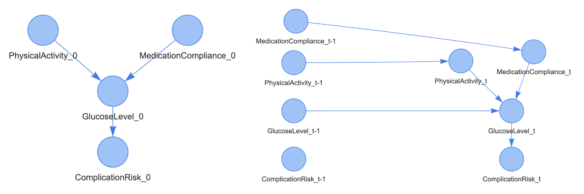
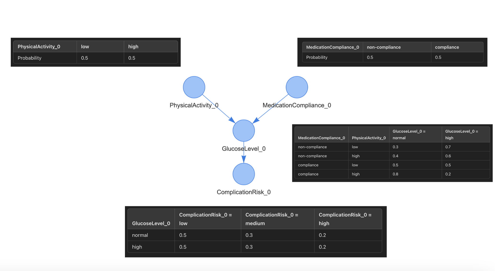
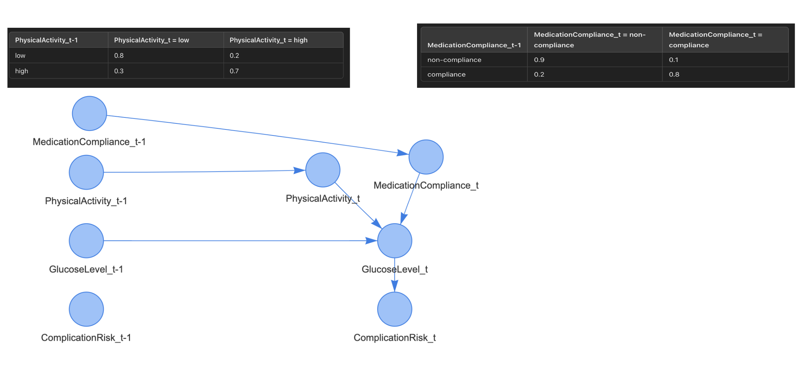
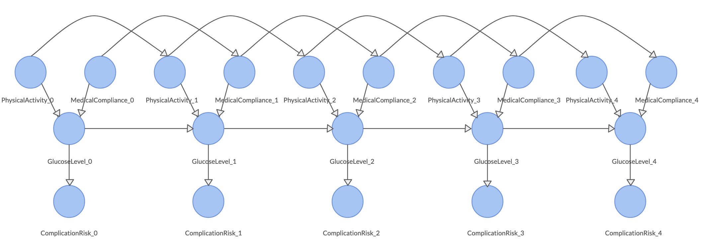

---
---
---

{width="227"}

# Diabetes Management with DBNcare 🧑🏻‍⚕️

## Use case

In this network, the nodes represent variables that are essential for managing diabetes over time, including:

-   **Medication Compliance**: Whether the patient adheres to prescribed treatments (compliance, non-compliace).

-   **Physical Activity**: The level of physical activity maintained by the patient (low, high).

-   **Glucose Level**: The blood glucose level, a critical factor in diabetes control (low, high).

-   **Complication Risk**: The probability of developing complications due to diabetes (low, medium, high).

The directed edges in this network represent dependecies between variables, both within a single time step and across sequential time steps.



```{r}
library(DynamicBayesianNetwork)
set.seed(10)

```

## Definition of the Diabetes Management DBN

```{r}
diabetes_management_dbn<-empty_DBN(dynamic_nodes = c("PhysicalActivity", "MedicationCompliance", "GlucoseLevel", "ComplicationRisk"),
              markov_order = 1)

```

```{r}

# Creating G_0
  diabetes_management_dbn <-
    add_arc_DBN(DBN = diabetes_management_dbn,
                from = c('PhysicalActivity', 't_0'),
                to = c('GlucoseLevel', 't_0'))
  diabetes_management_dbn <-
    add_arc_DBN(DBN = diabetes_management_dbn,
                from = c('MedicationCompliance', 't_0'),
                to = c('GlucoseLevel', 't_0'))
  
  diabetes_management_dbn <-
    add_arc_DBN(DBN = diabetes_management_dbn,
                from = c('GlucoseLevel', 't_0'),
                to = c('ComplicationRisk', 't_0'))
```

```{r}
# Creating G_transition
  diabetes_management_dbn <-
    add_arc_DBN(DBN = diabetes_management_dbn,
                from = c('PhysicalActivity', 't'),
                to = c('GlucoseLevel', 't'))
  
  diabetes_management_dbn <-
    add_arc_DBN(DBN = diabetes_management_dbn,
                from = c('MedicationCompliance', 't'),
                to = c('GlucoseLevel', 't'))
  
  diabetes_management_dbn <-
    add_arc_DBN(DBN = diabetes_management_dbn,
                from = c('GlucoseLevel', 't'),
                to = c('ComplicationRisk', 't'))
  
  diabetes_management_dbn <-
    add_arc_DBN(DBN = diabetes_management_dbn,
                from = c('PhysicalActivity', 't-1'),
                to = c('PhysicalActivity', 't'))
  
  diabetes_management_dbn <-
    add_arc_DBN(DBN = diabetes_management_dbn,
                from = c('MedicationCompliance', 't-1'),
                to = c('MedicationCompliance', 't'))
  
  diabetes_management_dbn <-
    add_arc_DBN(DBN = diabetes_management_dbn,
                from = c('GlucoseLevel', 't-1'),
                to = c('GlucoseLevel', 't'))
  
  
    
  
```

## Definition of the CPT of the Diabetes Management DBN





```{r}
#Defining CPT G_0
PhysicalActivity_lv <- c('low', 'high')
MedicationCompliance_lv <- c('non-compliance', 'compliance')
GlucoseLevel_lv <- c('normal', 'high')
ComplicationRisk_lv <- c('low', 'medium', 'high')


PhysicalActivity_0.prob <- array(
  c(0.5, 0.5),
  dim = length(PhysicalActivity_lv),
  dimnames = list(PhysicalActivity_0 = PhysicalActivity_lv)
)

MedicationCompliance_0.prob <- array(
  c(0.5, 0.5),
  dim = length(MedicationCompliance_lv),
  dimnames = list(MedicationCompliance_0 = MedicationCompliance_lv)
)

GlucoseLevel_0.prob <-
  array(
    c(0.3, 0.7, 0.4, 0.6, 0.5, 0.5, 0.8, 0.2),
    dim = c(
      length(GlucoseLevel_lv),
      length(PhysicalActivity_lv),
      length(MedicationCompliance_lv)
    ),
    dimnames = list(
      GlucoseLevel_0 = GlucoseLevel_lv,
      PhysicalActivity_0 = PhysicalActivity_lv,
      MedicationCompliance_0 = MedicationCompliance_lv
    )
  )

ComplicationRisk_0.prob <- array(
  c(0.95, 0.04, 0.01, 0.1, 0.3, 0.6),
  dim = c(length(ComplicationRisk_lv), length(GlucoseLevel_lv)),
  dimnames = list(ComplicationRisk_0 = ComplicationRisk_lv, GlucoseLevel_0 = GlucoseLevel_lv)
)


  
```

```{r}
#Defining CPT G_T

#defining dims for PhysicalActivity
dims_PhysicalActivity_t <- list(PhysicalActivity_t = PhysicalActivity_lv)
dims_PhysicalActivity_t[['PhysicalActivity_t-1']] = PhysicalActivity_lv
  
# defining dims for MedicationCompliance
dims_MedicationCompliance_t <- list(MedicationCompliance_t = MedicationCompliance_lv)
dims_MedicationCompliance_t[['MedicationCompliance_t-1']] = MedicationCompliance_lv
  

# defining dims for GlucoseLevel
dims_GlucoseLevel_t <- list(GlucoseLevel_t = GlucoseLevel_lv, PhysicalActivity_t = PhysicalActivity_lv, MedicationCompliance_t = MedicationCompliance_lv)
dims_GlucoseLevel_t[['GlucoseLevel_t-1']] = GlucoseLevel_lv


#defining PhysicalActivity_t CPT
PhysicalActivity_t.prob = array(c(0.8, 0.2, 0.3, 0.7),
                   dim = c(length(PhysicalActivity_lv), length(PhysicalActivity_lv)),
                   dimnames = dims_PhysicalActivity_t)

#defining MedicationCompliance_t CPT 
MedicationCompliance_t.prob=array(c(0.9, 0.1, 0.2, 0.8),
                   dim = c(length(MedicationCompliance_lv), length(MedicationCompliance_lv)),
                   dimnames = dims_MedicationCompliance_t)

#defining GlucoseLevel_t CPT
GlucoseLevel_t.prob <-
  array(
    c(0.7, 0.3, 0.5,0.5, 0.9,0.1, 0.9, 0.1, 0.2, 0.8, 0.5, 0.5, 0.5, 0.5, 0.5, 0.5),
    dim = c(length(GlucoseLevel_lv), length(PhysicalActivity_lv), length(MedicationCompliance_lv), length(GlucoseLevel_lv)),
    dimnames = dims_GlucoseLevel_t
  )

ComplicationRisk_t.prob <- array(
  c(0.95, 0.04, 0.01, 0.1, 0.3, 0.6),
  dim = c(length(ComplicationRisk_lv), length(GlucoseLevel_lv)),
  dimnames = list(ComplicationRisk_t = ComplicationRisk_lv, GlucoseLevel_t = GlucoseLevel_lv)
)

 CPTs_diabetes_management = list(
    PhysicalActivity_0 = PhysicalActivity_0.prob,
    MedicationCompliance_0 = MedicationCompliance_0.prob,
    GlucoseLevel_0 = GlucoseLevel_0.prob,
    ComplicationRisk_0=ComplicationRisk_0.prob,
    
    PhysicalActivity_t = PhysicalActivity_t.prob,
    MedicationCompliance_t = MedicationCompliance_t.prob,
    GlucoseLevel_t = GlucoseLevel_t.prob,
    ComplicationRisk_t=ComplicationRisk_t.prob
  )
  
  fitted_diabetes_management_dbn <- DBN_parameters(diabetes_management_dbn, CPTs_diabetes_management)
```

```{r}
CPTs_diabetes_management
```

```{r}
plot_g0(diabetes_management_dbn)

```

```{r}
plot_g_transition(diabetes_management_dbn)

```

## Sampling from the DBN

```{r}
#save the dataset to replicate the parameter learning and the structure learning
dbn_sampling(fitted_diabetes_management_dbn, 1, 5)

```

## Forecasting

```{r}
observations_list<-list(Time=c(0), PhysicalActivity=c("low"), MedicationCompliance=c("non-compliance"), GlucoseLevel=c("high"), ComplicationRisk=c("low"))

dbn_forecasting(fitted_diabetes_management_dbn, observations_list, 4)
```

## Inference

Inference can be performed in two ways:

-   Implementing inference using the Dynamic Bayesian Network framework e.g **rejection sampling**, **likelihood weighting** and all the algorithm belonging to the approximate inference category. Exact inference can be performed but the computational cost grows exponentially with "width" of the network see *Probabilistic Graphical Models Principles and Technique, Chapter 15th, Daphne Koller, Nir Friedman* for more details.

-   Adapting a Dynamic Bayesian Network to an unrolled Bayesian Network and as a result extending inference from the Bayesian Network framework with some limitations.

### Unrolled BN

To extend all the inference algorithm from the Bayesian Network framework we need to transform the Dynamic Bayesian Network to a unrolled Bayesian Network.



```{r}
diabetes_management_dbn_unrolled<-get_unrolled_dbn(fitted_diabetes_management_dbn, 5)

```

### Exact Inference

```{r}
library(gRain)
library(bnlearn)
```

```{r}
# Inference is performed by unrolling the network, allowing us to perform exact inference and approximate inference from grain and bnlearn respectively.

cpquery(diabetes_management_dbn_unrolled, event = (ComplicationRisk_5 == "high"), evidence = ((GlucoseLevel_5 == "normal") & (MedicationCompliance_4 == "non-compliance") & (PhysicalActivity_4== "high")))
```

### Approximate Inference

Logic Sampling

```{r}
cpquery(diabetes_management_dbn_unrolled, 
        event = (ComplicationRisk_5 == "high"), 
        evidence = (GlucoseLevel_5 == "normal") & 
                   (MedicationCompliance_4 == "non-compliance") & 
                   (PhysicalActivity_4 == "high"), n=10^6)
```

Likelihood Weighting

```{r}
cpquery(diabetes_management_dbn_unrolled, 
        event = (ComplicationRisk_5 == "high"), 
        evidence = list(GlucoseLevel_5 = "normal", 
                        MedicationCompliance_4 = "non-compliance", 
                        PhysicalActivity_4 = "high"), 
        method = "lw")
```

## 
